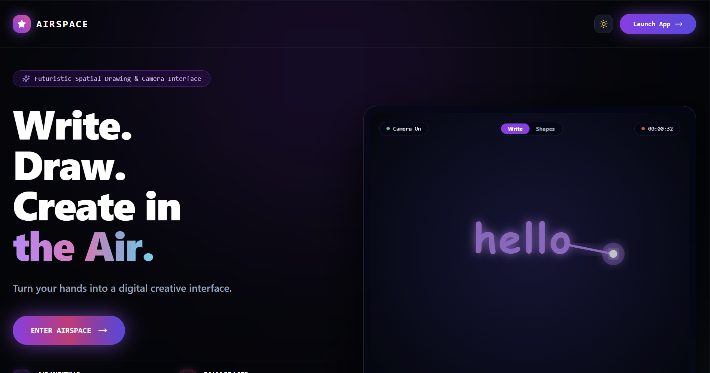
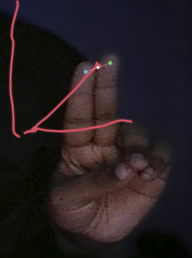
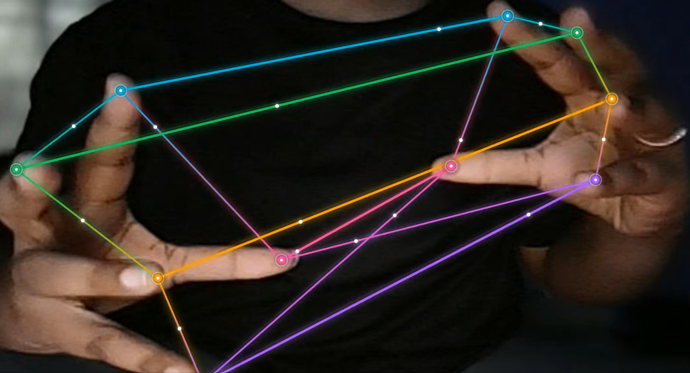
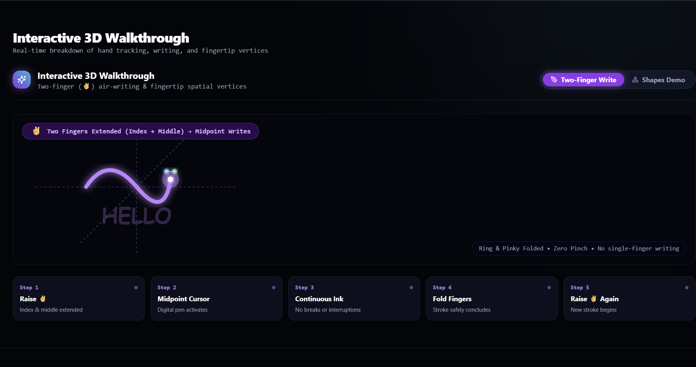

# AIRSPACE: Touchless Spatial Human-Computer Interaction Platform

> **Write. Draw. Create in the Air.**  
> AIRSPACE is a high-performance spatial computing application that transforms standard webcam feeds into an intuitive touchless creative interface using client-side computer vision, real-time gesture telemetry, and continuous digital ink rendering.

---

## 🖥️ Interface Preview

### 1. Spatial Workspace & Landing Experience


> **Futuristic Spatial Canvas**: Seamless entry into the live webcam creative environment featuring dark-mode glassmorphism UI, real-time camera state telemetry, mode switching (`Write` / `Shapes`), recording timer, and instant application launch.

---

### 2. Two-Finger (✌️) Continuous Air Writing
<div align="center">
  
</div>

> **Touchless Marker Handwriting**: Activated by an intentional two-finger pose (index + middle fingers extended with ring and pinky folded). Tracks the exact spatial midpoint between index tip (#8) and middle tip (#12) as the glowing pen cursor. Built with gesture hysteresis, velocity-adaptive ink deposition, and spline gap interpolation to ensure smooth, continuous board-quality handwriting without breaks or jitter.

---

### 3. Spatial Fingertip Geometry (Shapes Mode)


> **Multi-Hand Dynamic Constellations**: In Shapes Mode, the writing pipeline is cleanly suppressed while fingertip landmarks serve as 3D spatial vertices. Laser edges dynamically connect interacting fingertips between both hands in real time, forming responsive geometric networks and spatial polygons that react naturally to hand depth and movement.

---

### 4. Interactive 3D Gesture Walkthrough


> **Real-Time Onboarding & Gesture Mechanics**: Interactive visual guide breaking down the two-finger (✌️) air-writing lifecycle across 5 distinct phases: *Raise ✌️ &rarr; Midpoint Cursor &rarr; Continuous Ink &rarr; Fold Fingers to Conclude &rarr; Raise ✌️ for New Stroke*. Also includes interactive geometric previews for lines, triangles, quadrilaterals, and spatial networks.

---

## 🚀 Feature Highlights

- **Live Camera as Workspace**: The mirrored camera feed serves as the primary canvas—digital ink and spatial geometry render directly over live video.
- **Two-Finger (✌️) Air Writing**: Index + Middle extended with midpoint cursor tracking. Zero pinch gesture required.
- **Palm Eraser**: Full open palm gesture displays a circular eraser halo to clear nearby strokes while preserving surrounding work.
- **Fingertip Spatial Vertices**: Fingertips form geometric vertices connected by real-time laser edges with multi-hand support.
- **Advanced Creative Popovers**: Compact vertical floating toolbar providing immediate access to Pen Styles (*Marker, Brush, Neon, Glow, Precision*), continuous stroke sizing with live S-curve preview, curated color palettes, and visual effects.
- **Composited Recording & Snapshot**: In-browser CanvasStream recorder captures webcam video, digital ink, and spatial shapes into a unified video or high-res PNG snapshot.
- **Client-Side Privacy**: All MediaPipe landmark detection executes locally in the browser via WebAssembly (WASM). No raw camera frames or biometric streams leave the device.

---

## 🏢 Technology Stack & Architecture

- **Frontend**: Next.js 14 (App Router), React 18, TypeScript, Tailwind CSS, Lucide Icons, HTML5 Canvas.
- **Client-Side Vision**: MediaPipe Hands via WASM / WebAssembly for real-time 21-landmark 3D hand tracking at 30–60 FPS.
- **Backend API**: FastAPI, Uvicorn, Python 3.10+, WebSockets.
- **ORM & Database**: SQLAlchemy, Alembic, PostgreSQL 15 (Docker containerized).
- **Computer Vision & AI Engines**: Custom modules (`packages/cv` and `packages/ai`) incorporating NumPy, SciPy, and DTW stroke matching.

---

## 📂 Project Structure

```
AIRSPACE/
  ├── apps/
  │   ├── frontend/             # Next.js spatial camera application & canvas UI
  │   │   ├── public/           # Static assets and screenshot previews
  │   │   └── src/
  │   │       ├── components/   # Workspace, toolbar, and 3D demo components
  │   │       ├── hooks/        # Camera, MediaPipe hand tracking, and recording hooks
  │   │       └── utils/        # Gesture classification, stroke renderer, and spatial shapes
  │   └── backend/              # FastAPI backend API & WebSockets server
  ├── packages/
  │   ├── cv/                   # Computer Vision Core landmarks engines
  │   ├── ai/                   # AI algorithms, DTW recognizer, & OCR
  │   └── shared/               # Shared communication message schemas
  ├── public/
  │   └── screenshots/          # High-resolution interface previews for repository
  ├── docs/                     # Architecture & Product documentation
  ├── scripts/                  # Setup, testing, and dev runners
  ├── docker-compose.prod.yml   # Production Compose orchestration
  └── README.md                 # Main repository showcase documentation
```

---

## ⚙️ Environment Variables

Copy `.env.example` at the root directory to `.env` and fill in parameters:

```ini
# Backend host & Port configuration
BACKEND_HOST=0.0.0.0
BACKEND_PORT=8000
BACKEND_CORS_ORIGINS=["http://localhost:3000"]
ENVIRONMENT=production

# Database Credentials
POSTGRES_USER=postgres
POSTGRES_PASSWORD=replace_with_secure_production_password
POSTGRES_DB=airspace
POSTGRES_HOST=postgres
POSTGRES_PORT=5432

# Frontend Endpoint Hooks
NEXT_PUBLIC_API_URL=http://localhost:8000
NEXT_PUBLIC_WS_URL=ws://localhost:8000/ws/spatial
```

---

## 🛠️ Local Development Setup

### 1. Prerequisites
Ensure Node.js (v18+) and Python (v3.10+) are installed on your machine.

### 2. System Initialization
Run the automated setup script to configure the Python virtual environment, link workspace packages, and install dependencies:
```powershell
./scripts/setup.ps1
```

### 3. Database Bootstrap
Apply database schema migrations via Alembic:
```powershell
cd apps/backend
alembic upgrade head
```

### 4. Running the Development Stack
Start the frontend Next.js server, backend FastAPI server, and database concurrently:
```powershell
./scripts/dev.ps1 -Service All
```
Navigate to `http://localhost:3000` to launch AIRSPACE.

---

## 🐳 Production Docker Orchestration

To build and run the entire multi-container production stack:
```powershell
docker compose -f docker-compose.prod.yml up --build
```

---

## 🧪 Automated Test Suite

Execute Backend, CV, AI, and Frontend test suites concurrently:
```powershell
powershell -ExecutionPolicy Bypass -File .\scripts\test.ps1
```

Or run frontend unit and integration tests directly:
```powershell
cd apps/frontend
npx jest --watchAll=false
```

---

## 🔒 Privacy & Edge Security

AIRSPACE executes all computer vision algorithms strictly client-side inside the user's browser runtime using MediaPipe WebAssembly. No webcam images, video streams, or raw facial/biometric data are transmitted over the network or saved to database storage.

---

## 📄 License

This project is open source and available under the [MIT License](LICENSE).
