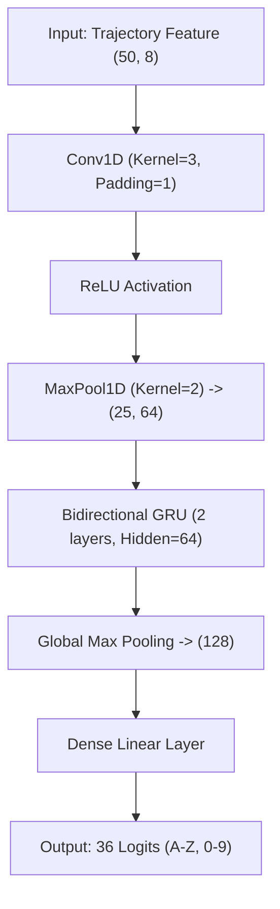

# AIRSPACE: Spatially Tracked Handwriting Recognition (AIR WRITE)

This document describes the machine learning architecture, preprocessing pipelines, and classification models used to translate real-time hand fingertip gestures into digital text characters.

---

## 1. Problem Definition & OCR vs. Trajectory Recognition

Conventional Optical Character Recognition (OCR) systems process static two-dimensional raster images of text (e.g. PNG, JPEG). These systems rely on pixel intensities and spatial features, completely discarding the temporal information of writing.

**Spatially Tracked Handwriting Recognition** is fundamentally different:
1. **Dynamic Temporal Signals**: The inputs are ordered sequences of coordinates $(x_t, y_t, t)$ capturing the exact trajectory, stroke sequence, speed, and writing direction.
2. **Stroke-Level Representation**: A letter like 'A' contains distinct lines (strokes) drawn in sequence. The order in which they are drawn provides strong structural cues that image-based OCR misses.
3. **No Pixel Grids**: Rather than storing heavy image grids, we only store a sparse list of vector points, resulting in a highly efficient representation.

---

## 2. Dataset Schema (`datasets/air-writing/raw/`)

Each collected character sample is exported to a separate JSON file with the following schema:

```json
{
  "sample_id": "uuid-v4-string",
  "label": "A",
  "points": [
    [
      { "x": 0.35, "y": 0.78, "z": 0.0, "t": 1690023450000 },
      { "x": 0.50, "y": 0.21, "z": 0.0, "t": 1690023450033 }
    ]
  ],
  "timestamp": 1690023450
}
```

---

## 3. Preprocessing Pipeline

To ensure the classifier is robust to varying writing speeds, offsets, and scales, raw coordinates undergo the following pipeline:

1. **Noise Filtering**: Removes duplicate points or minor jitter:
   $$\Delta d = \sqrt{(x_t - x_{t-1})^2 + (y_t - y_{t-1})^2} < 0.001$$
2. **Exponential Smoothing (EMA)**:
   $$x_{\text{smooth}, t} = \alpha \cdot x_{\text{raw}, t} + (1 - \alpha) \cdot x_{\text{smooth}, t-1}$$
3. **Centering (Translation Normalization)**: Shifts the centroid of the bounding box to the origin $(0, 0)$:
   $$x_c = \frac{1}{N}\sum_{i=1}^N x_i, \quad y_c = \frac{1}{N}\sum_{i=1}^N y_i$$
4. **Scale Normalization**: Scales the coordinate bounding box to fit inside a $[-1.0, 1.0]$ square, maintaining aspect ratio.
5. **Time Normalization (Resampling)**: Interpolates the points along the cumulative distance path to produce exactly $N=50$ points.

---

## 4. Feature Engineering

For each resampled point, we extract an 8-dimensional feature vector:
* `[0, 1]`: Normalized coordinates $(x, y)$
* `[2, 3]`: Velocity $(v_x, v_y) = (\Delta x / \Delta t, \Delta y / \Delta t)$
* `[4, 5]`: Acceleration $(a_x, a_y) = (\Delta v_x / \Delta t, \Delta v_y / \Delta t)$
* `[6]`: Movement direction angle in radians: $\theta = \text{arctan2}(v_y, v_x)$
* `[7]`: Curvature: $\kappa = \Delta \theta / \Delta s$

---

## 5. Baseline Model (Dynamic Time Warping 1-NN)

We implement a Dynamic Time Warping (DTW) classifier. It measures the optimal warping alignment distance between the resampled input and our programmatic template vectors for the 36 classes (A-Z, 0-9).

* **Warping Distance Formula**:
  $$D(i, j) = \text{cost}(i, j) + \min(D(i-1, j), D(i, j-1), D(i-1, j-1))$$
* **Confidence Rating**:
  $$\text{Confidence} = e^{-D_{\min} \cdot 4.0}$$
* **Threshold Fallback**: If the highest confidence score is below the threshold, it is classified as `UNKNOWN` to avoid false positives.

---

## 6. Custom PyTorch Model (1D CNN + BiGRU)

For Phase B training, we define a sequence network that processes the $(50, 8)$ feature matrices:



### Rationale
* **1D Conv**: Extracts local spatial stroke shape patterns (e.g. sharp corners, loops).
* **BiGRU**: Captures sequence dependencies bidirectionally (past and future movements of the finger).

---

## 7. Limitations & Future Directions
* **Isolated Characters**: Currently requires manual segmentation between characters. Continuous cursive word recognition is a natural next step.
* **Complex Background Jitter**: Hand Landmarker noise can occur in low-light environments. Adding a custom Kalman Filter to smooth input coordinates would improve robustness.
