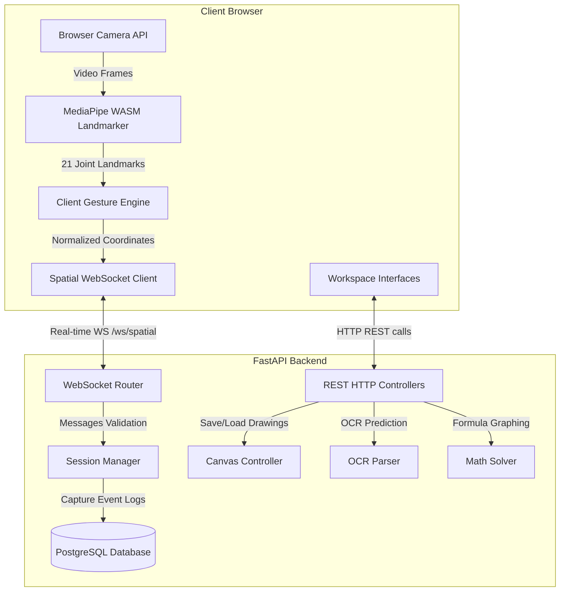

# AIRSPACE Platform Architecture

This document describes the structural components, data channels, and feature pipelines running the AIRSPACE platform.

---

## 1. System Topology

---

## 2. Feature Pipelines

### A. Air Write Pipeline (Handwriting Recognition)
1. **Pinch State Start** $\rightarrow$ Trajectory capture records mirrored fingertip coordinates.
2. **Pinch State End** $\rightarrow$ Captures final path stroke array.
3. **REST POST `/api/air-write/recognize`** $\rightarrow$ Passes stroke arrays.
4. **Recognition Matcher** $\rightarrow$ Trajectory runs through the Dynamic Time Warping (DTW) character recognition engine. If custom datasets have labels, the CNN-BiGRU handwriting classifier provides supplementary predictions.
5. **Accept / Correct Confirmation** $\rightarrow$ Persists confirmed values to database writing sessions logs.

### B. Air Canvas Pipeline (Vector Sketching)
1. **Interactive Tools selection** $\rightarrow$ User toggles PEN, ERASER, or SELECT/PAN tools.
2. **Real-time Draw** $\rightarrow$ Pinch and drag triggers drawing coordinates.
3. **Shape Classification `/api/canvas/recognize-shape`** $\rightarrow$ Recognizes circles, rectangles, triangles, arrows, and lines.
4. **Geometric Replacement** $\rightarrow$ Replaces rough strokes with perfect vectors.
5. **JSON DB Serialization** $\rightarrow$ Serializes layers arrays directly into the `Drawing.svg_data` column.

### C. Math Mode Pipeline (Expression Solver & Grapher)
1. **Math Canvas Writing** $\rightarrow$ Spatial canvas captures mathematical expression drawing.
2. **Solve Endpoint `/api/math/solve`** $\rightarrow$ Converts drawing strokes to equations text via spatial baseline classifiers.
3. **Evaluation Engine** $\rightarrow$ Solves the equation and returns solutions, step explanations, and graphing coordinate arrays.
4. **SVG Neon Curves Render** $\rightarrow$ Dynamic canvas plots mathematical functions.

### D. AI Lab / Intent Engine Pipeline
1. **Chat input / Voice Transcript** $\rightarrow$ Injects spatial workspace metadata (shapes, canvas count, selections).
2. **Intent Parser** $\rightarrow$ Classifies keywords (e.g. "solve", "draw", "explain").
3. **Context Resolution** $\rightarrow$ Generates tailored action responses (updating drawings, suggesting calculus answers, or answering questions).
